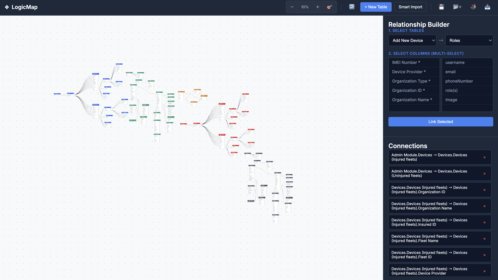

# ❖ LogicMap
> **A Professional, Infinite Database Schema Visualizer.**
> *Design, visualize, and export complex database relationships with zero friction.*

[](https://thevikramsinha.github.io/logicmap)
[]()
[]()

---



## 📖 About
**LogicMap** is a high-performance Entity Relationship Diagram (ERD) tool designed for developers who need speed, clarity, and structural integrity. Unlike heavy enterprise tools, LogicMap runs entirely in the browser using pure Vanilla JavaScript—no frameworks, no backend, and no lag.

It features a true **infinite canvas**, **intelligent face-to-face routing** (Bezier curves), and a robust **Group Integrity** system that keeps your imported schemas organized via color-coding and batch movement.

## ✨ Key Features

* **🧠 Smart Layout Engine:** Automatically detects canvas usage and places new tables in a neat grid in empty space. No more overlapping stacks.
* **🧜‍♀️ Mermaid.js Support:** Import existing Mermaid `erDiagram` code directly, or export your visual canvas back to Mermaid syntax.
* **🎨 50+ Color Themes & Hex Support:** Every import batch is automatically assigned a unique color from a high-contrast 50-color palette. For manual tables, use the integrated native color picker to select any custom Hex color for headers, allowing for unlimited organizational possibilities.
* **🔗 Intelligent Routing:** Relationships are drawn with smooth Bezier curves that automatically detect the best "face" (Top, Bottom, Left, Right) to connect to, keeping your diagram clean.
* **📦 Group Integrity:** Move entire clusters of tables at once using the Group Handle (⋈) or Shift+Drag.
* **🔍 True Infinite Canvas:** Unbounded panning and zooming allow you to manage massive schemas with hundreds of tables.
* **📤 Interactive Exports:** Generate a standalone **HTML Snapshot** that includes an embedded viewer engine (Zoom/Pan) for sharing with clients.
* **⚡ Smart Multi-Linker:** Select multiple source columns and multiple target columns to create complex relationships in one click.

## 🚀 Quick Start

### Online
Visit the live demo: **[https://thevikramsinha.github.io/logicmap](https://thevikramsinha.github.io/logicmap)**

### Local Installation
Since LogicMap is dependency-free, you don't need `npm` or `build` steps.

1.  **Clone the repository:**
    ```bash
    git clone [https://github.com/thevikramsinha/logicmap.git](https://github.com/thevikramsinha/logicmap.git)
    ```
2.  **Open it:**
    Simply double-click `index.html` in your browser.

## 🛠️ How to Use

### 1. Creating Tables
* **Manual:** Click `+ New Table`, name it, select a **Color Theme**, and add columns.
* **Smart Import:** Click `Smart Import` and paste either a Mermaid diagram or simple text:
    ```mermaid
    erDiagram
      USER ||--o{ ORDER : places
      USER { string name string email }
      ORDER { int id string item }
    ```

### 2. Building Relationships
1.  Use the **Relationship Builder** sidebar.
2.  Select a **Source Table** and a **Target Table**.
3.  Click the columns you want to link (Multi-select supported).
4.  Click **Link Selected**. The tool intelligently determines 1:1, 1:N, or N:1 based on your selection.

### 3. Managing Groups
* **Move Group:** Hover over any table header and drag the **⋈** icon to move that entire color group at once.
* **Drag & Drop:** Drag tables individually to refine the layout. The auto-spacing engine ensures they don't overlap when dropped.

### 4. Exporting
* **HTML Snapshot:** Downloads a file containing your diagram + a lightweight viewer engine (Zoom/Pan included).
* **Mermaid Code:** Exports the current schema text for use in documentation (GitHub/Notion).
* **JSON:** Save your project state locally. Loading a JSON **appends** to the current canvas rather than overwriting it.

## 🤝 Contributing
Contributions are welcome! If you have ideas for features, feel free to fork the repo and submit a Pull Request.

1.  Fork the Project
2.  Create your Feature Branch (`git checkout -b feature/AmazingFeature`)
3.  Commit your Changes (`git commit -m 'Add some AmazingFeature'`)
4.  Push to the Branch (`git push origin feature/AmazingFeature`)
5.  Open a Pull Request

## 👤 Author

**Vikram Kumar Sinha**
* GitHub: [@thevikramsinha](https://github.com/thevikramsinha)

## 📄 License
Distributed under the MIT License. See `LICENSE` for more information.
